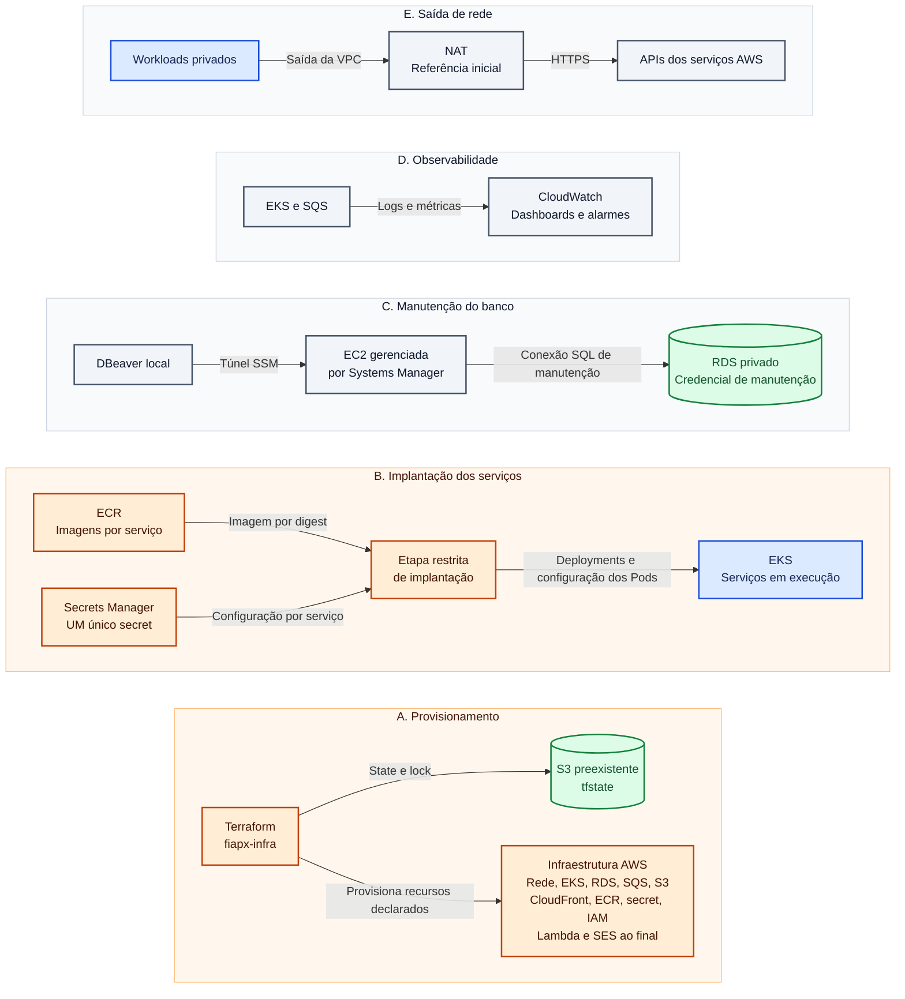
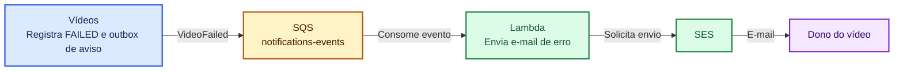
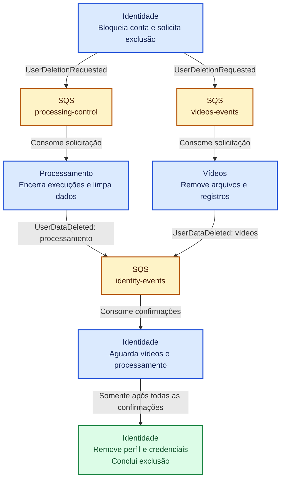
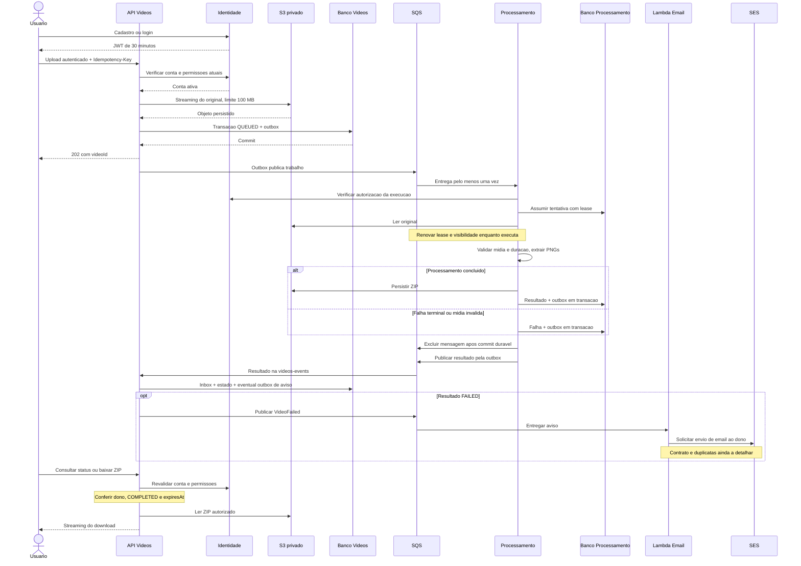
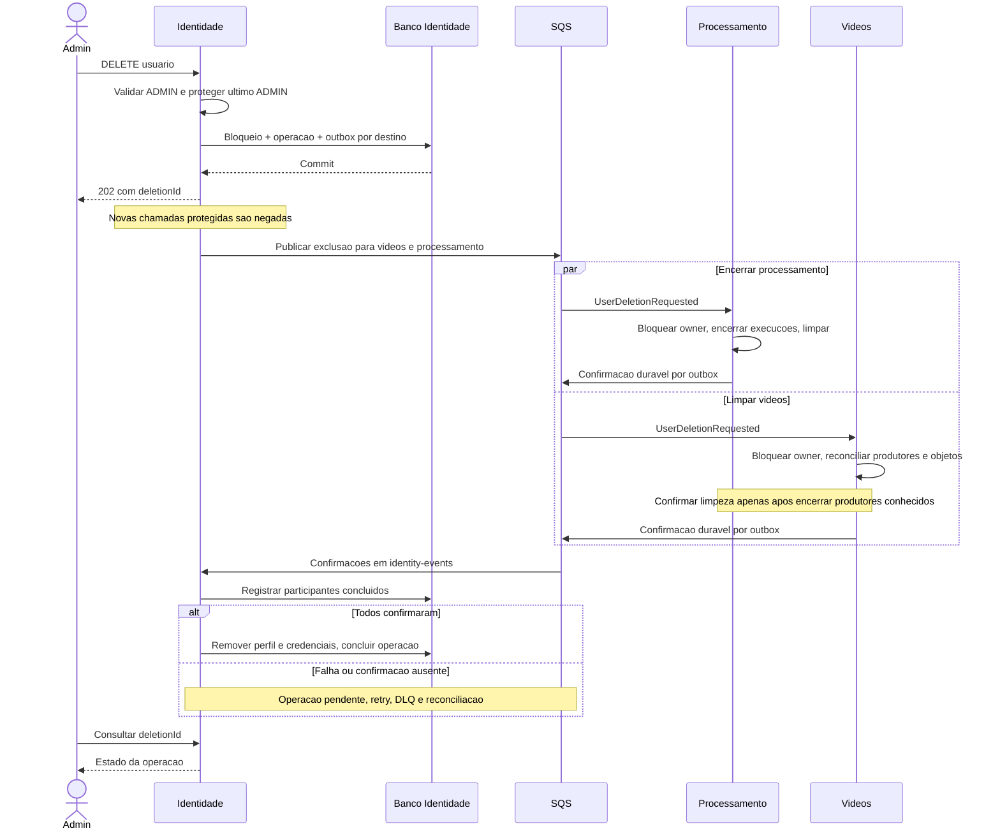

# Diagramas de arquitetura

Desenho de referência, ainda não implantado integralmente. Os diagramas complementam a [visão integrada](consolidated.md) e os [contratos](integration.md). Região: us-east-1. Domínio/certificado, dimensionamento e parâmetros operacionais ainda precisam de definição. O alvo é três microsserviços no EKS e uma Lambda de e-mail. Notificação e exclusão distribuída são fluxos planejados, não implementados.

## Componentes e infraestrutura

A arquitetura aparece em duas visões complementares: **acesso à aplicação e dados**, seguida de **implantação e operação**. Isso separa as requisições do usuário das atividades administrativas. Elementos repetidos nas duas visões representam os mesmos recursos.

**Legenda:**
* roxo = acesso e frontend
* azul = microsserviços e execução
* verde = armazenamento
* amarelo = mensageria
* laranja = configuração e implantação
* cinza = operação e rede.

- As setas têm seu propósito indicado no rótulo.
- Ligações ao bloco EKS representam dependências do conjunto de serviços, não acesso de todos os Pods a todos os recursos.

### 1. Acesso à aplicação e dados

Leitura da esquerda para a direita: usuário, entrada HTTPS, aplicações e persistência. O S3 do frontend serve arquivos estáticos, enquanto o S3 de mídia guarda originais e ZIPs privados.

```mermaid
flowchart LR
    USER["Navegador<br/>HTML e JavaScript"] -->|HTTPS| CF["CloudFront"]
    CF -->|"Frontend privado via OAC"| WEB[("S3<br/>Frontend")]
    CF -->|"/api/* sem cache"| ALB["ALB<br/>Origem HTTPS"]

    subgraph EKS["Amazon EKS - três microsserviços"]
        direction TB
        ID["Identidade<br/>Usuários, JWT e permissões"]
        VID["Vídeos<br/>Upload, status e download"]
        PROC["Processamento<br/>FFmpeg e ZIP<br/>Sem API pública de negócio"]
    end

    ALB -->|"APIs de identidade e vídeos"| EKS
    EKS -->|"Cada serviço acessa seu banco"| DB[("RDS PostgreSQL privado<br/>Uma instância, três bancos<br/>Identidade · Vídeos · Processamento")]
    EKS <-->|"Vídeos e processamento: objetos"| MEDIA[("S3 privado<br/>Originais e ZIPs")]
    EKS <-->|"Publicação e consumo por serviço"| QUEUES["SQS<br/>5 filas funcionais + 5 DLQs"]
    QUEUES -->|"Falha definitiva"| NOTIF["Lambda de e-mail"]
    NOTIF -->|"Solicita envio"| SES["SES"]
    SES -->|"E-mail de erro"| OWNER["Dono do vídeo"]

    classDef access fill:#F3E8FF,stroke:#7E22CE,color:#3B0764,stroke-width:2px
    classDef service fill:#DBEAFE,stroke:#1D4ED8,color:#172554,stroke-width:2px
    classDef storage fill:#DCFCE7,stroke:#15803D,color:#14532D,stroke-width:2px
    classDef queue fill:#FEF3C7,stroke:#B45309,color:#451A03,stroke-width:2px
    class USER,CF,ALB,OWNER access
    class ID,VID,NOTIF,PROC,SES service
    class WEB,DB,MEDIA storage
    class QUEUES queue
    style EKS fill:#EFF6FF,stroke:#1D4ED8,stroke-width:2px,color:#172554
```

**Conexões internas omitidas para legibilidade:** vídeos e processamento consultam identidade conforme seus contratos. A obtenção segura do destinatário da Lambda ainda será definida. ALB encaminha rotas aos serviços HTTP, sem expor o worker ou criar uma API de notificações. O detalhamento das filas aparece abaixo; apenas trabalho e resultados estão provisionados no estado atual.

**Limites de rede:** ALB fica na camada de entrada da VPC, workloads e RDS na camada privada. CloudFront, S3 e SQS são serviços AWS representados fora do bloco EKS, não Pods. O desenho é lógico e não representa subnets ou AZs em escala. A origem HTTPS do ALB requer domínio/certificado válido.

### 2. Implantação e operação

Cada linha mostra uma responsabilidade operacional. As referências ao EKS e ao RDS apontam para os mesmos recursos da visão anterior. As setas de Terraform indicam gestão de infraestrutura, não requisições de negócio.

O bucket de estado já existe e fica fora do ciclo de destruição da aplicação. Recursos criados por controllers Kubernetes, como o ALB, mantêm sua propriedade definida na infraestrutura, sem gerenciamento concorrente pelo Terraform.

As configurações entregues aos Pods não criam novos secrets no AWS Secrets Manager. Cada serviço recebe sua configuração, enquanto a credencial de manutenção fica separada. A referência inicial de NAT único e RDS Single-AZ não demonstra alta disponibilidade. Rotas, endpoints e dimensionamento serão detalhados na implantação.

## Mensageria por fluxo

Os três diagramas abaixo mostram os fluxos separadamente. Nomes de fila repetidos representam a mesma fila física, não filas adicionais. Etapas repetidas do serviço de vídeos ou identidade também representam o mesmo microsserviço em momentos diferentes.

**Legenda:**
* azul = ação de um microsserviço
* amarelo = fila SQS
* verde = resultado do fluxo
* roxo = interface.

- Setas contínuas mostram publicação, consumo ou progressão interna conforme o rótulo.
- Seta pontilhada representa consulta HTTP, não mensagem SQS.
- Os textos identificam o papel dos elementos mesmo sem as cores.

**DLQs:** cada uma das cinco filas funcionais possui sua própria DLQ. Elas foram omitidas das setas para destacar os fluxos de negócio. Mensagens que excedem a política de recebimentos seguem para a DLQ correspondente, com alarme, análise e reprocessamento controlado. Ir para a DLQ não atualiza automaticamente o status do vídeo nem conclui uma exclusão.

### 1. Processamento do vídeo

Começa após o aceite durável do vídeo. O processamento informa início, conclusão ou falha e o serviço de vídeos atualiza o estado público do trabalho.

```mermaid
flowchart LR
    V1["Vídeos<br/>Solicita processamento"] -->|VideoProcessingRequested| QW["SQS<br/>processing-work"]
    QW -->|Consome trabalho| P["Processamento<br/>Valida mídia e gera ZIP"]
    P -->|ProcessingStarted / ProcessingCompleted / ProcessingFailed| QV["SQS<br/>videos-events"]
    QV -->|Consome evento| V2["Vídeos<br/>Atualiza status do trabalho"]

    classDef service fill:#DBEAFE,stroke:#1D4ED8,color:#172554,stroke-width:2px
    classDef queue fill:#FEF3C7,stroke:#B45309,color:#451A03,stroke-width:2px
    classDef result fill:#DCFCE7,stroke:#15803D,color:#14532D,stroke-width:2px
    class V1,P service
    class QW,QV queue
    class V2 result
```

DLQs deste fluxo: `processing-work` e `videos-events` possuem destinos de falha próprios. O verde indica o resultado do fluxo de mensagens, não necessariamente sucesso do processamento: o status também pode ser FAILED.

### 2. Notificação de falha

Planejado para depois do fluxo principal na cloud. Começa quando vídeos registra uma falha definitiva e outbox; a Lambda envia e-mail ao dono. Contrato, destinatário e política de duplicatas ainda serão detalhados.

A fila `notifications-events` terá DLQ própria e retentativas limitadas. Sem consulta de avisos pelo navegador ou banco de notificações. Falha no envio não reinicia o vídeo. Envio externo e confirmação do consumo não são uma transação única; não se promete exatamente um e-mail.

### 3. Exclusão definitiva de usuário

Identidade bloqueia a conta e solicita limpeza a vídeos e processamento. A exclusão só termina após as confirmações dos proprietários. A antiga limpeza do banco de avisos foi removida; a política de e-mails pendentes após exclusão ainda precisa de definição antes de implementar este fluxo.

Cada fila representada possui DLQ própria. Se uma solicitação ou confirmação falhar, a exclusão permanece pendente e a conta continua bloqueada. Cada serviço confirma somente após reconciliar escritas e execuções concorrentes, evitando que um trabalho atrasado recrie dados já removidos.

Publicações usam outbox por destino, consumo de domínio usa inbox e efeito transacional idempotente. Réplicas compartilham sua fila. SQS Standard pode duplicar e reordenar mensagens, tentativa e versão impedem regressão do estado. O alvo mantém cinco filas funcionais e cinco DLQs, com notificações dedicada somente a e-mail; isso não representa cinco filas já provisionadas.

## Upload, processamento e download

O caminho final de download aplica-se apenas a resultado concluído e não expirado, demais estados produzem resposta de erro apropriada. Duração e conteúdo são verificados após aceite durável: 202 não garante mídia válida. Consultas protegidas falham se a situação da conta não puder ser verificada. Início do processamento também é publicado com tentativa/versão, esse evento foi omitido da sequência para legibilidade.

## Exclusão definitiva de usuário

Marcadores técnicos mínimos impedem recriação por mensagens antigas, não conservam o perfil excluído. Confirmação de limpeza considera concorrência com uploads e workers. Backups expiram pela política operacional e restauração reaplica exclusões. A conta não volta a ter acesso se uma etapa falhar.
